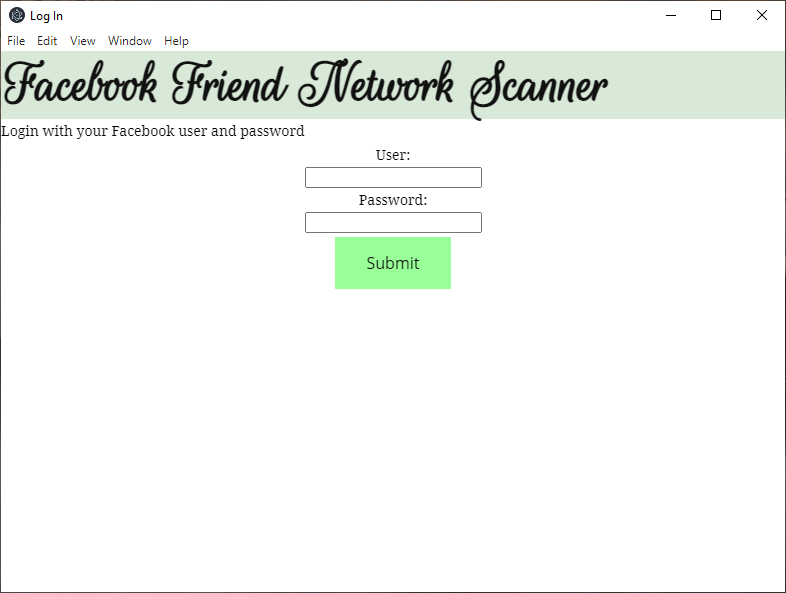
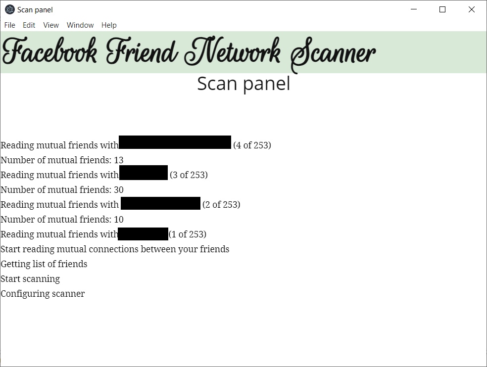
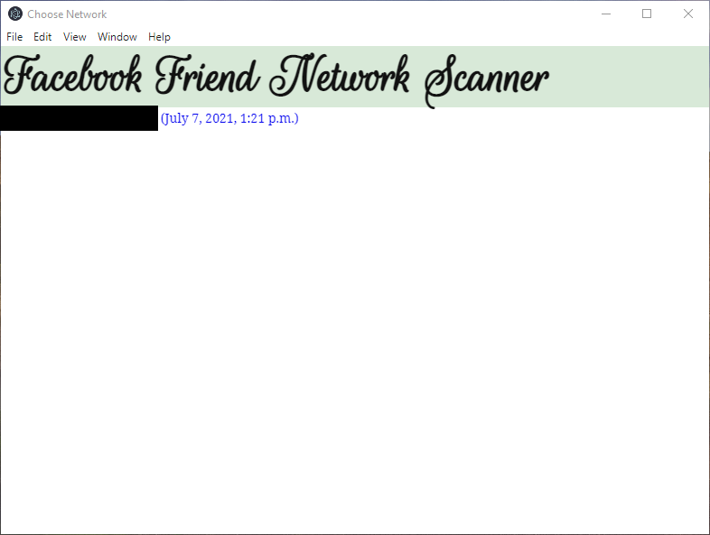
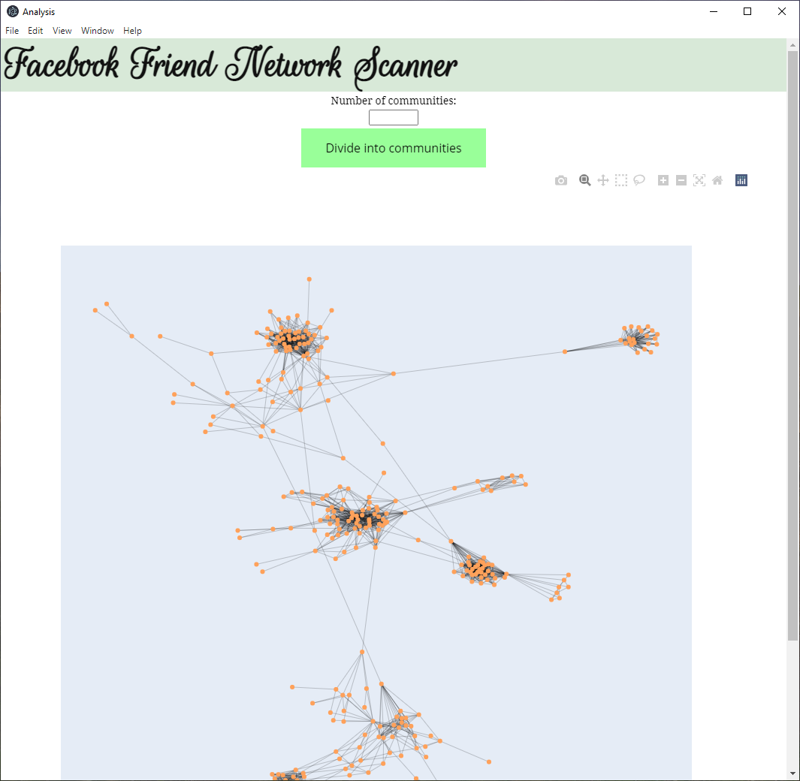
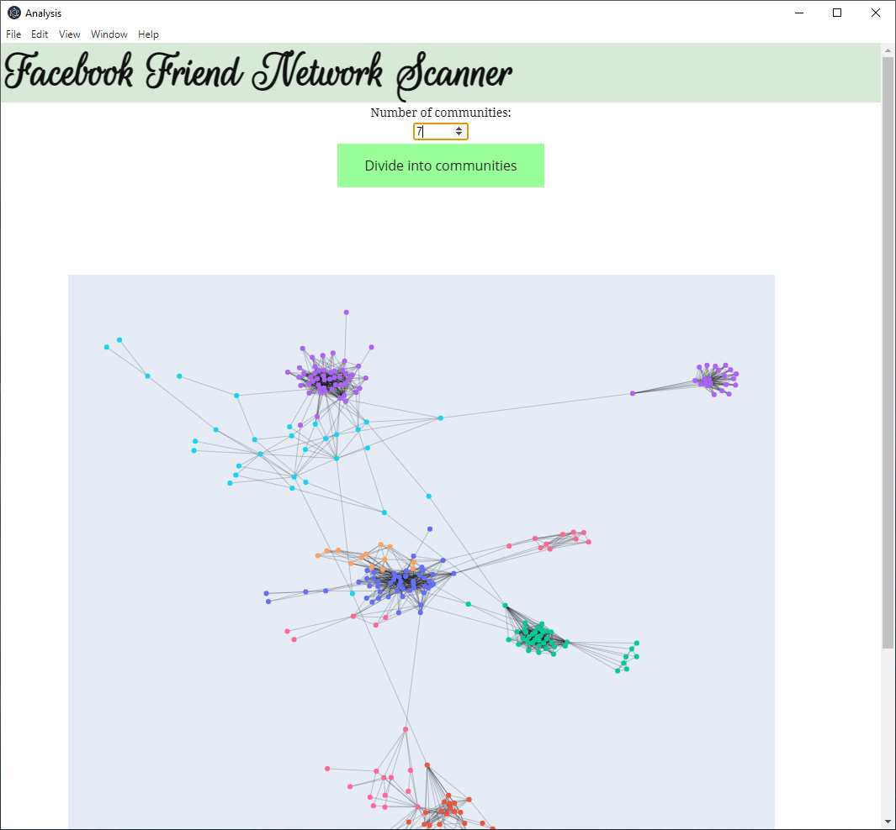

# Introduction

## About the app

This project is about web scraping your personal (my personal, but you should work on yours) Facebook profile using Selenium from Python.

With this tool you can download the information about which of your friends are friends between them, and which of them don't know each other.
Then you can find the different communities among your friends with social network analysis algorithms and finally visualize them in interactive plots.
Finally, all of this is wrapped up in a simple GUI.

In summary, a mix of techniques and technologies that create a cool application for exploring your social from a network analysis standpoint.

You can read more in this [article](https://medium.com/analytics-vidhya/read-your-network-of-friends-in-facebook-by-scraping-with-python-a012adabb713) and this [article](https://rubchume.medium.com/organize-your-wedding-with-social-network-analysis-in-python-aeab9d8814b3).

## Approach
The application is implemented in the Python.

The package used for network analysis is [NetworkX](https://networkx.org/).

The interactive visualizations are created using [Plotly](https://plotly.com/).

The GUI uses [Electron](https://www.electronjs.org/) for the frontend, and [Django](https://www.djangoproject.com/) as a backend.

## Conclusions

Even though I didn't perform a thorough analysis but a visual exploration, there were some curious findings that you might replicate with your network.
Among other things, I realized that almost all of my friends are connected.

When there is a dense network of friends (dots of the same color) that is connected by just one connection to other community, in almost all cases the connection is a surprise you didn't know.
For example, I discovered that a cousin of mine knew one of my childhood friends, and that a person I knew while studying in another country knows one of my salsa lessons classmates.

What do you think you will discover?

# How to use
The welcome page has three buttons:

You can press the header "Facebook Friend Network Scanner" to come back to the main page at any moment.

Press "Start New Scan" to start the scan of your network. You will be required to enter your Facebook user and password.
However, the password will not be stored in any way in the database or in any file.


Once you press submit, you will be redirected to the "Scan progress page".

It will only scan the friends of yours that are officially active in Facebook (that did not deactivate their account).
However, if you suspect the app missed some of your friends, which sometimes happens (it is a bug that currently exists), just close the app and start a new scan again.

When it's finished, you can press the third button from the main page: "Analysis".
There you can select the scan instance. If you only used it for one Facebook account, there will be only one possibility:


Wait for the network to be processed and then you will see an interactive visualization:


Finally, you can use the [Fluid Communities algorithm](https://networkx.org/documentation/stable/reference/algorithms/generated/networkx.algorithms.community.asyn_fluid.asyn_fluidc.html#networkx.algorithms.community.asyn_fluid.asyn_fluidc) to divide the network into communities:


**NOTE**
 
Beware Facebook changes its web and API often, so this web app will very likely stop working soon. However, you can take the current code and update it so it works again.

Check out the previously mentioned [article](https://www.listeningtothedata.com/posts/read-your-network-of-friends-in-facebook-by-scraping-with-python/) in order to find out how you can do it.   

# Setup
## Installation of packages
The application needs to be executed in an environment with Python 3.8 installed.

If this is the case, proceed with the installation of necessary packages. Open the CLI (Command Line Interface) and execute:
```bash
pip install -r requirements.txt
```

## Execution
```
npm start
```

Or, if you don't have npm available, use
```
start_analyzer.sh
```
and visit http://127.0.0.1:8000/.

## Test
Test the application with Pytest using
```bash
python -m pytest
```
